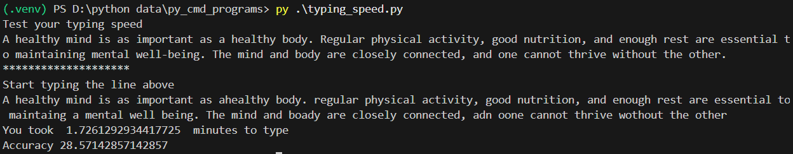
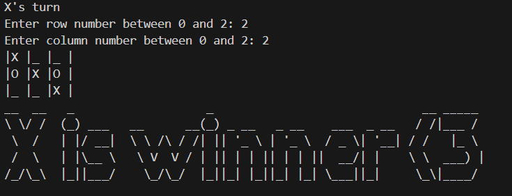

# Command Line Fun

This repository contains two Python command-line programs:

1. **Typing Speed Test**
2. **Tic-Tac-Toe**

Both programs are designed to be simple yet interactive for users to enjoy while running them in a terminal. They operate in a virtual environment (`.venv`), ensuring all dependencies are contained and isolated.

---

## Prerequisites

- Python 3.8 or higher
- A virtual environment (`.venv`) set up for the project

---

## Installation

1. Clone this repository:
   ```bash
   git clone https://github.com/Mapur2/Command-Line-Fun.git
   ```

2. Create and activate a virtual environment:
   ```bash
   python -m venv .venv
   source .venv/bin/activate  # On Windows, use `.venv\Scripts\activate`
   ```

3. Install the required libraries:
   ```bash
   pip install -r requirements.txt
   ```

---

## Programs Overview

### 1. Typing Speed Test

**Description**:  
The Typing Speed Test measures your typing speed and accuracy. You will be given a random paragraph to type, and the program will calculate your performance based on the time taken and the accuracy of your input.

**Usage**:  
Run the program:
```bash
python typing_speed_test.py
```

Follow the on-screen instructions:
1. A paragraph will be displayed.
2. Type it as quickly and accurately as possible.
3. The program calculates:
   - Time taken (in minutes)
   - Typing accuracy (percentage)

**Example**:


---

### 2. Tic-Tac-Toe

**Description**:  
A two-player, text-based Tic-Tac-Toe game. Players alternate turns to place their symbols (`X` or `O`) on a 3x3 grid. The game ends when one player wins or the board is full (draw).

**Usage**:  
Run the program:
```bash
python tic_tac_toe.py
```

Follow the on-screen instructions:
1. Players input row and column numbers (0–2) to place their symbol.
2. The program displays the board after each move.
3. ASCII art announces the winner or declares a draw.

**Example**:


---

## Virtual Environment Management

To ensure smooth operation:
- Always activate the virtual environment before running the programs:
  ```bash
  source .venv/bin/activate
  ```

- To deactivate the environment:
  ```bash
  deactivate
  ```

---

## Requirements File

The dependencies for this project are stored in `requirements.txt`. To generate this file (if new dependencies are added), use:
```bash
pip freeze > requirements.txt
```

To install dependencies from the file:
```bash
pip install -r requirements.txt
```

---

## Contributing

If you have ideas or improvements, feel free to fork this repository, create a new branch, and submit a pull request.

---

Happy coding! 🎉
